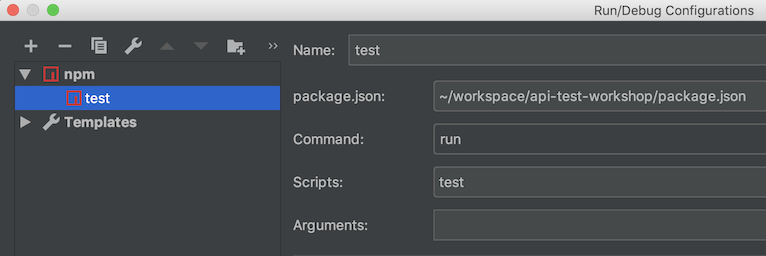
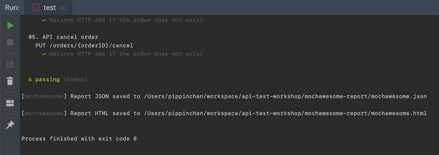
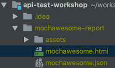
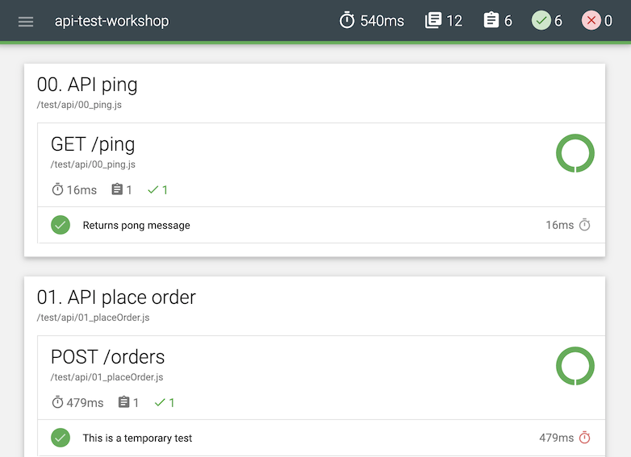

# API test workshop

This API test uses Node.js libraries as follows
- Runner: [Mocha](https://mochajs.org/#getting-started)
- Timestamps: [Moment](https://momentjs.com/docs)
- Assertion API: [Chai](https://www.chaijs.com/api/)
- JSON Schema validation: [ajv](https://ajv.js.org/)
- HTTP requester: [Chai HTTP](https://www.chaijs.com/plugins/chai-http/)
- HTML report: [Mochawesome](https://www.npmjs.com/package/mochawesome)

## i. Installation
1. Install and run [the sample API](https://github.com/lalamove/challenge/blob/master/set_api.md#how-to-run-the-above-api-on-your-local-machine) in your local machine's docker first.
2. Check if the API is running, `http://localhost:51544/ping`.
3. At this directory, `npm install`.

## ii. Executing Tests

Before running tests, check whether information in `test/config.js` is correct.

### IntelliJ
1. Create an `npm run test` profile in your run configurations. \

2. Use the play or debug button. \

### Terminal
1. At this directory, `npm run test`.
2. Console similar to above should be printed.

## iii. Viewing Reports
- Immediately after test run finishes the summary and case-by-case results are printed in console.
- Additionally, HTML report is generated under `mochawesome-report/` directory. \

- In HTML report, actual requests & response could be checked by expanding each test case. \

-----

#### Notes:
* As [discouraged by Mochajs.org](https://mochajs.org/#arrow-functions), ECMAScript 6 arrow functions are not used in test spec functions.
* Test data is now stored in `test/data` directory. But some data can be sourced from the SUT itself, for example, error messages or fare tables.
* As some API results are questionable, some tests are left failed with comments in the code.
#### Assumptions
* Server would not use number `0` as order ID.
> **Result:** In 404 order not found tests, `0` is used as order ID.
* In price calculations, numbers are rounded to 2 decimal points.
> **Result:** In price tests, `0.01` is used as comparison threshold.
* At local docker deployment, server is running in UTC timezone.
> **Result:** All generated timestamps in test scripts are in UTC. \
If not, server's timezone can be adjusted in file `test/config.js` at this line. \
`timezone: '+00:00'`
