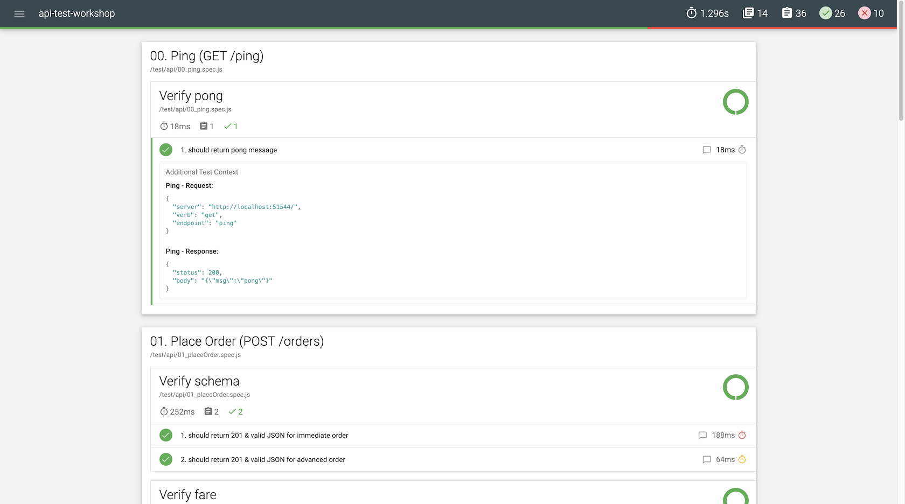

# API test workshop

This API test uses Node.js libraries as follows
- Runner: [Mocha](https://mochajs.org/#getting-started)
- Assertion API: [Chai](https://www.chaijs.com/api/)
- HTTP requestor: [Chai HTTP](https://www.chaijs.com/plugins/chai-http/)
- HTML report: [Mochawesome](https://www.npmjs.com/package/mochawesome)

## i. Installation
1. Install and run [the sample API](https://github.com/lalamove/challenge/blob/master/set_api.md#how-to-run-the-above-api-on-your-local-machine) in your local machine's docker first.
2. Check if the API is running, `http://localhost:51544/ping`.
3. At this directory, `npm install`.

## ii. Executing Tests

Before running tests, check whether API endpoints in `test/config.js` is correct.

### IntelliJ
1. Create an `npm run test` profile in your run configurations. \

2. Use the play or debug button. \

### Terminal
1. At this directory, `npm run test`.
2. Console similar to above should be printed.

## iii. Viewing Reports
- Immediately after test run finishes the summary and case-by-case results are printed in console.
- Additionally, HTML report is generated under `mochawesome-report/` directory. \
 \

